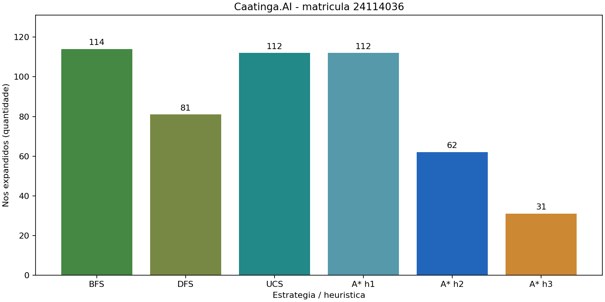

# Caatinga.AI — Sprint 1

## 1. Identificação

- **Disciplina:** Inteligência Artificial — UniRios — **2026.2**.
- **Professor:** Ronierison Maciel.
- **Autor:** ANTONIO GOMES SOUZA NETO — **241.14.036**
- **Matrícula usada como semente:** `24114036` (o gerador aplica módulo e usa `114036`).

## 2. O que o projeto faz

Simula a navegação de um agente em um pomar de manga com terrenos de custos diferentes.  
Compara BFS, DFS, UCS e A* com três heurísticas, registrando rotas e esforço de busca.  
Seleciona 15 inspeções sob bateria limitada com subida de encosta e têmpera simulada.  
Explica decisões por regras e calcula o impacto dos falsos alertas com Bayes.  
Gera evidências reproduzíveis para a auditoria do laudo de um fornecedor.

## 3. Como rodar

**Python 3.10 ou superior**; execução verificada com **Python 3.12**. Única dependência direta: Matplotlib 3.10.6. Em um terminal na raiz do projeto:

```bash
python -m pip install -r requirements.txt
python src/main.py 24114036
```

Esse comando cria/recria `resultados/resultados.csv`, `resultados/grafico.png`, `resultados/pomar.txt` e os resultados complementares. Faz também **30 execuções de cada busca local**. Na máquina de desenvolvimento, a execução integrada levou aproximadamente dez segundos; o tempo varia com o ambiente.

Ensaio de escalabilidade (processos isolados; limite de 60 s por busca, até a primeira falha):

```bash
python src/escalabilidade.py 24114036
```

Testes automatizados, incluindo execução completa com duas sementes:

```bash
python -m unittest discover -s tests -v
```

Para outra matrícula, preserve os resultados do relatório usando outra pasta:

```bash
python src/main.py 20231045 --saida resultados_outra_semente
```

Também aceita `241.14.036`. Sem `--saida`, a execução substitui os arquivos gerados na pasta `resultados` do projeto. O relatório e este README descrevem exclusivamente `24114036` e não são reescritos automaticamente. O código funciona mesmo quando chamado a partir de outro diretório.

## 4. Tabela-resumo

| Estratégia | Heurística | Custo (u.c.) | Passos | Nós expandidos | Fronteira máxima (entradas) |
|---|---|---:|---:|---:|---:|
| BFS | — | 46 | 22 | 114 | 12 |
| DFS | — | 131 | 62 | 81 | 63 |
| UCS | — | 36 | 24 | 112 | 16 |
| A* | h1=0 | 36 | 24 | 112 | 16 |
| A* | h2=Manhattan | 36 | 24 | 62 | 17 |
| A* | h3=4×Manhattan | 51 | 24 | 31 | 18 |



## 5. Convenções

**Ordem: Norte, Sul, Oeste, Leste. A* reabre estados.** Filas de prioridade desempataram por ordem de inserção. Objetivo testado ao retirar entrada válida, antes da expansão; o objetivo não conta como expandido. Fronteira conta entradas físicas, incluindo obsoletas no heap. DFS é recursiva e sua fronteira é a pilha de quadros ativos; visitados/pais não entram nesse contador. Portanto, fronteira máxima não é uma medição de bytes de memória. O custo inicial não é contado.

## 6. Mapa do repositório

| Arquivo | Responsabilidade |
|---|---|
| [RELATORIO.md](RELATORIO.md) | Respostas completas, todas as tabelas, provas, auditoria e bônus. |
| [ANEXO_IA.md](ANEXO_IA.md) | Registro específico e verdadeiro do uso de IA. |
| `requirements.txt` | Dependência direta para gerar o gráfico. |
| `.gitignore` | Impede versionamento de ambiente virtual e caches. |
| `src/__init__.py` | Define o pacote Python. |
| `src/gerador_pomar.py` | Gerador e parâmetros do sensor, preservados do enunciado. |
| `src/buscas.py` | BFS, DFS, UCS, A*, contadores e reabertura. |
| `src/busca_local.py` | Modelo de inspeções, bateria e dois algoritmos locais. |
| `src/especialista.py` | Sete regras iniciais, correção R8 e encadeamento para trás. |
| `src/bayes.py` | VPP, falsos alertas, horas e dois testes. |
| `src/experimentos.py` | Aferição, comparação global e contraexemplos. |
| `src/main.py` | Comando único de execução e escrita dos artefatos. |
| `src/escalabilidade.py` | Medição em processos isolados até falha real. |
| `tests/test_gerador.py` | Sementes, formato e alcançabilidade. |
| `tests/test_buscas.py` | Validade de rotas e oráculo Bellman–Ford independente. |
| `tests/test_astar.py` | Ótimo, h=0, reabertura e bônus. |
| `tests/test_busca_local.py` | Distâncias direcionadas, viabilidade e pareamento. |
| `tests/test_especialista.py` | Provas, ciclos, correção e conflitos de intervalo. |
| `tests/test_bayes.py` | Contas manuais e probabilidades extremas. |
| `tests/test_escalabilidade.py` | Processos, limite de tempo e falha de recursão. |
| `tests/test_integracao.py` | Comando completo em pastas vazias com duas sementes. |
| `resultados/resultados.csv` | Tabela global, incluindo tempo em ms. |
| `resultados/grafico.png` | Gráfico com eixos e unidades rotulados. |
| `resultados/pomar.txt` | Matrícula e grade usada no relatório. |
| `resultados/resumo.json` | Rotas, seleções, roteiros e resultados completos. |
| `resultados/afericao.json` | Comparação com a matrícula fictícia do PDF. |
| `resultados/contrato_gerador.json` | Conferência textual e hash do gerador. |
| `resultados/bonus_dfs.json` | Grade construída, rotas e custos DFS/UCS. |
| `resultados/busca_local.csv` | 60 execuções com sementes e viabilidade. |
| `resultados/busca_local_resumo.json` | Médias, desvios amostrais e melhores valores. |
| `resultados/busca_local_tracos.json.gz` | Todos os rastros em JSON comprimido. |
| `resultados/tempera_execucao_1.json` | Um rastro completo legível sem descompressão. |
| `resultados/especialista.json` | Base e árvores de prova antes/depois. |
| `resultados/especialista_tracos.txt` | Explicações textuais emitidas pelo programa. |
| `resultados/bayes.json` | Cálculos sem arredondamento intermediário. |
| `resultados/escalabilidade.csv` | Medições de crescimento e primeira falha observada. |
| `resultados/escalabilidade.json` | Medições com ambiente Python/Windows. |
| [docs/ARGUICAO.md](docs/ARGUICAO.md) | Roteiro de estudo e perguntas sobre o código. |
| [docs/VERIFICACAO.md](docs/VERIFICACAO.md) | Evidências, revisão e pendências de conferência. |
| [docs/erro_ia_reabertura.md](docs/erro_ia_reabertura.md) | Erro real de teste cometido pelo assistente e investigação. |
| `docs/superpowers/specs/2026-09-25-caatinga-ai-sprint1-design.md` | Especificação aprovada durante o planejamento. |
| `docs/superpowers/plans/2026-09-25-caatinga-ai-sprint1.md` | Plano de implementação e verificação. |

## 7. Limitações conhecidas

- DFS recursiva falha por `RecursionError` em n=100 nesta máquina; o relatório explica o limite. O caminho ótimo é garantido por UCS e A* h2, não por DFS ou h3.
- Busca local usa benefícios e conversão tempo/custo sintéticos. A subida de encosta terminou por teto de avaliações, não por máximo local confirmado. Os algoritmos locais e o roteiro por vizinho mais próximo não garantem ótimo global.
- A base especialista é pequena e ilustrativa; sensor, robô e infestação real não foram implementados. Dois testes independentes são apenas um cenário de cálculo.
- Tempos variam; contadores e custo devem reproduzir as convenções declaradas. Limite de recursão pode mudar entre versões/ambientes.
- O histórico tem 9 commits.
- O projeto foi clonado e executado em outro computador pelo autor, além da verificação local em ambiente virtual novo.
